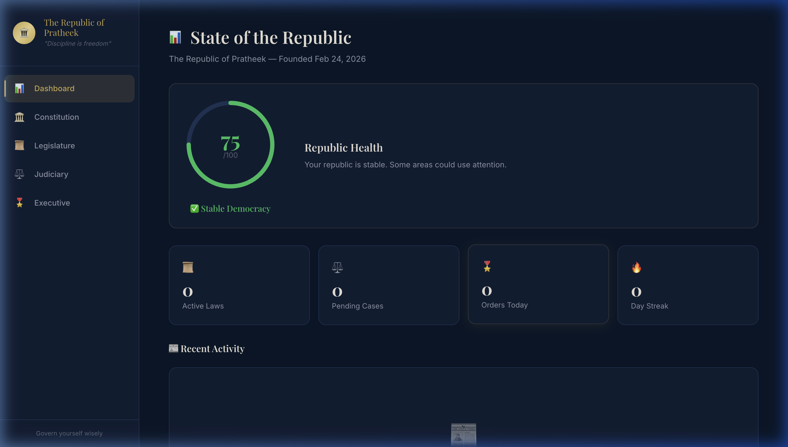
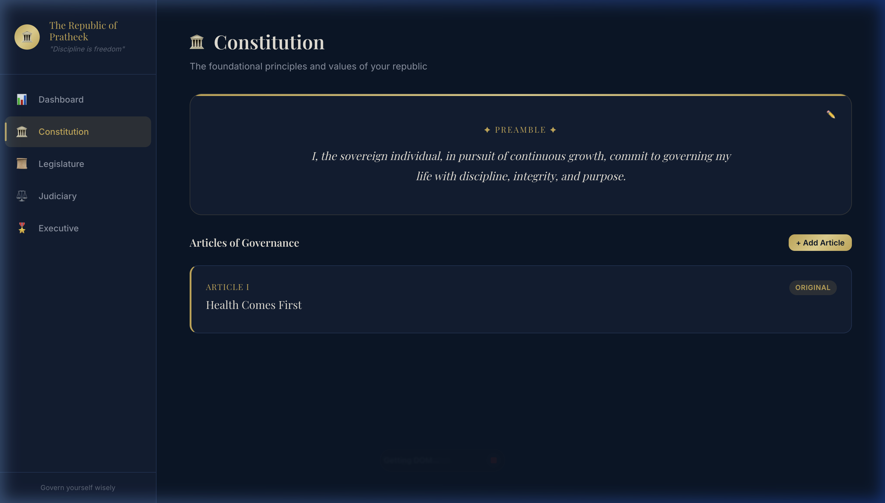
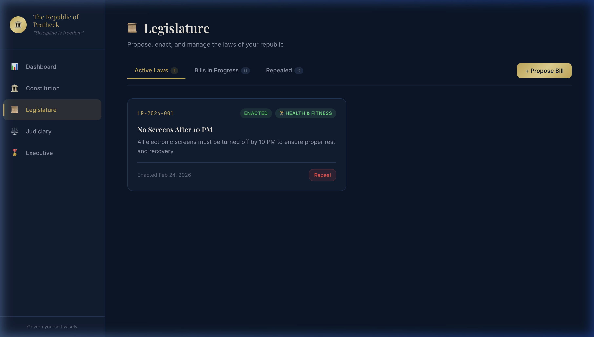
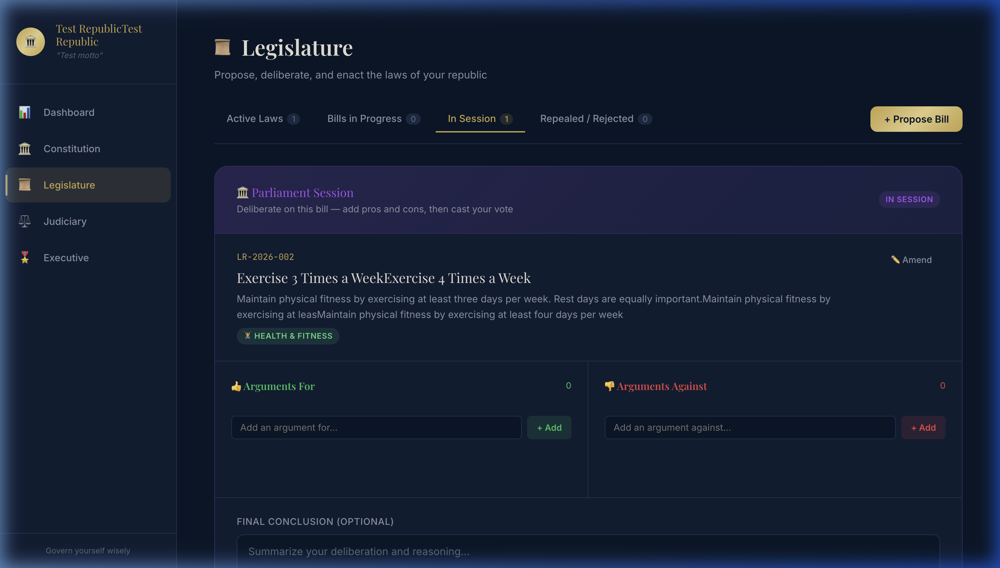
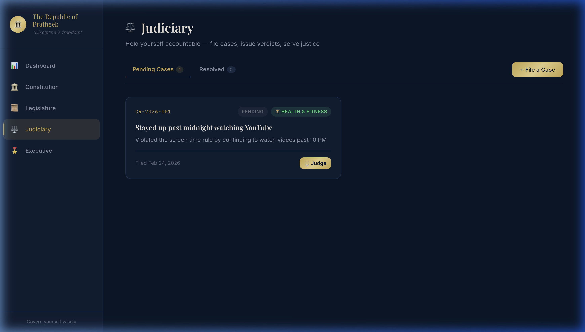
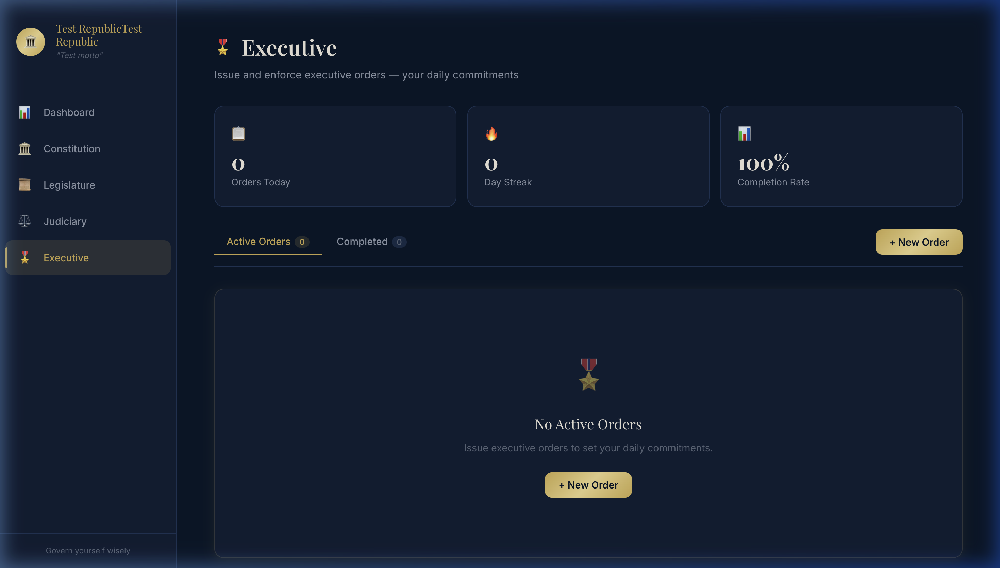

# 🏛️ MyRepublic — Personal Life Governance

> *"Govern yourself wisely."*

MyRepublic transforms personal development into an act of self-governance. Model your life as a republic — write a constitution, pass laws, judge yourself when you break them, and issue executive orders as daily commitments. Everything is tracked with a health score so you can see how well you're governing.

---

## 📸 Screenshots

### Dashboard
Your republic's "state of the union." A health score gauge (0–100) scores you across law adherence, order completion, constitutional coverage, and more. Stat cards show active laws, pending cases, today's orders, and your streak.



### Constitution
Write a preamble — your personal mission statement. Then ratify articles: the core principles you live by. Amend them as you evolve.



### Legislature
Propose bills (personal rules), advance them through a deliberation process, and enact them into law. Repeal laws that no longer serve you.



### Parliament Session
Before enacting a bill, open a **Parliament Session** to deliberate. Add pros and cons, watch the score bar shift, write a conclusion, then vote to enact or reject. You can also **amend** the bill's text mid-session.

`Draft → Proposed → Parliament Session → Enacted / Rejected`



### Judiciary
When you break your own rules, **file a case** against yourself. Issue verdicts (Guilty / Not Guilty / Pardoned), assign sentences (corrective actions), and mark them as served.



### Executive
Issue **executive orders** — your daily commitments. Track completion with checkbox-style interactions, monitor your streak, and see your 30-day completion rate.



---

## ✨ Features

| Feature | Description |
|---------|-------------|
| **Health Score** | Weighted score (0–100) across 5 pillars of governance |
| **Constitution** | Preamble + Articles with amendment history |
| **Legislature** | Full bill lifecycle with Parliament Session deliberation |
| **Parliament Session** | Pros/cons debate, score bar, conclusion, amend & vote |
| **Judiciary** | File cases, issue verdicts, track sentences |
| **Executive Orders** | Daily commitments with streaks and completion tracking |
| **Departments** | Health, Finance, Learning, Career, Relationships, Wellbeing |
| **Activity Feed** | Timeline of all governance actions |
| **Dark Theme** | Premium dark UI with gold accents |
| **Cloud Sync** | Real-time Firebase Firestore syncing across devices |
| **Security** | Firebase Authentication (Google Sign-In) to protect your Republic |

---

## 🌐 Live Demo

The app is fully deployed and accessible from any device.

**[Launch MyRepublic](https://my-republic-app.vercel.app)**

## 🚀 Getting Started

```bash
# Clone the repo
git clone https://github.com/pratheeknaidu/government.git
cd government

# Install dependencies
npm install

# Setup Firebase environment variables
# Create a .env.local file with your Firebase config:
# VITE_FIREBASE_API_KEY=...
# VITE_FIREBASE_AUTH_DOMAIN=...
# VITE_FIREBASE_PROJECT_ID=...

# Run the dev server
npm run dev
```

Open [http://localhost:5173](http://localhost:5173) and found your republic.

---

## 🛠️ Tech Stack

- **React 19** — UI framework
- **React Router 7** — Client-side routing
- **Vite** — Build tooling
- **Vanilla CSS** — Custom design system (dark theme, glassmorphism, CSS variables)
- **Firebase Auth** — Google Sign-In authentication
- **Firebase Firestore** — Real-time cloud database for cross-device syncing

---

## 📁 Project Structure

```
src/
├── App.jsx                 # Root layout with routing
├── store.js                # State management (useRepublic hook)
├── utils.js                # Helpers (dates, health score, departments)
├── index.css               # Full design system
├── components/
│   ├── Modal.jsx           # Accessible modal with Escape key support
│   ├── Sidebar.jsx         # Navigation sidebar
│   └── Toast.jsx           # Toast notifications
└── pages/
    ├── Dashboard.jsx       # Health gauge + activity feed
    ├── Constitution.jsx    # Preamble + articles
    ├── Legislature.jsx     # Bills + Parliament Session
    ├── Judiciary.jsx       # Cases + verdicts
    ├── Executive.jsx       # Orders + streaks
    └── Setup.jsx           # Onboarding flow
```

---

## 📄 License

MIT
